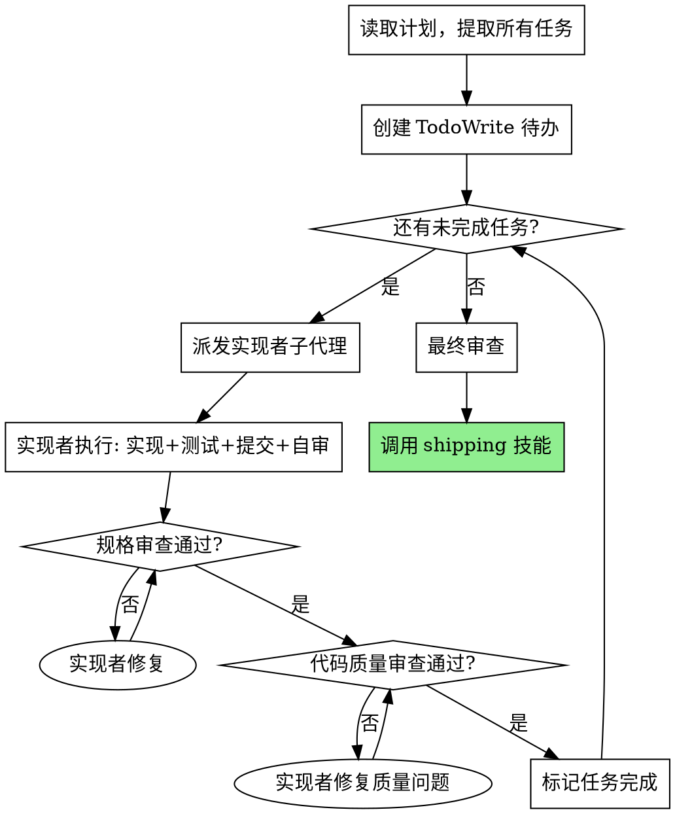

## 子代理驱动开发

**前提：** 有一个通过 planning 技能创建的 PLAN.md 文件。

**宣布：** "我正在使用 implementing 技能，按计划逐任务执行开发。"

## 核心模式

**每个任务 = 一个新子代理 + 双阶段审查**

为什么用子代理：
- 每个子代理获得干净的上下文，不受之前任务污染
- 专注单一任务，减少错误
- 编排器保持轻量，只管协调

## 执行流程



## 子代理指令模板

### 实现者子代理
```
你的任务：[任务描述]
文件：[文件路径]
上下文：[必要的项目上下文]

要求：
1. 使用 TDD — 先写失败测试，再写最小实现
2. 完成后创建原子提交：git add -A && git commit -m "[类型]: [描述]"
3. 自审代码：检查边界情况、错误处理、命名
```

### 规格审查子代理
```
任务规格：[从计划中提取]
请验证实现是否匹配规格要求。检查：
- 所有功能点是否实现
- 测试是否覆盖规格要求
- 边界情况是否处理
```

### 代码质量审查子代理
```
请审查代码质量：
- 函数 < 50 行，文件 < 800 行
- 嵌套 < 5 层
- 错误处理完整
- 命名清晰
- 无硬编码值
```

## 原子提交策略

每个任务完成后立即提交：
```bash
git add -A
git commit -m "<type>: <task-description>"
```

## 集成要求

- 子代理**必须**使用 `superopc:tdd` 技能
- 所有任务完成后，调用 `superopc:shipping` 技能

## 压力测试

### 高压场景
- 计划已定，但执行时想顺手改需求。

### 常见偏差
- 边做边重新设计，导致范围漂移。

### 使用技能后的纠正
- 严格按计划逐任务执行，只在必要时显式回到规划。

